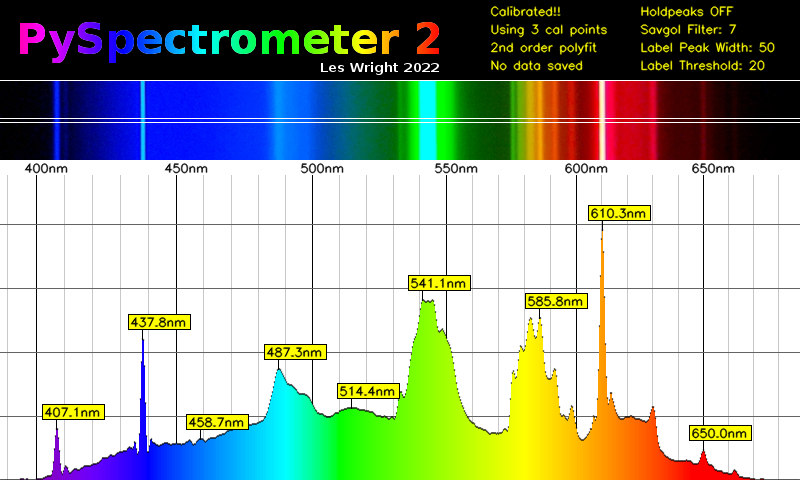
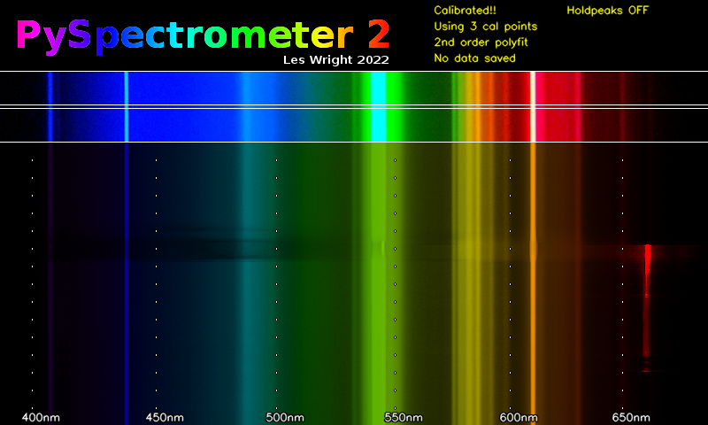

# PySpectrometer2
The Second Incarnation of the Spectrometer project!

PySpectrometer2 Les Wright 2022
https://www.youtube.com/leslaboratory
https://github.com/leswright1977

This project is a follow on from: https://github.com/leswright1977/PySpectrometer 

This is a more advanced, but more flexible version of the original program. It changes the spectrometer from 'toy' to serious instrument!

Recent changes broke the old vesion, hich was fixed(Incompatibilities with Bullseye including broken video, broken dependencies and so on. PyPspectromer3 v3.0 was hacked and fixed as of 3.1), however I have been thinking about a rewrite of this software for a while, so here it is!

Tk has been dropped as the GUI to allow easier maintainability, extendability and flexibility. The new interface is coded entriely in OpenCV, and whilst things like trackbars and buttons are now dropped in favour of keybindings, this frees up screen real estate, and allows the support of resizing without fuss, and fullscreen mode is now supported!

In Fullscreen mode on Raspberry Pi systems, the interface is designed to fit 800*480 screens, which seem to be a common resolution for RPi LCD's, paving the way for the creation of a stand alone benchtop instrument.

Whats new:

Higher reolution (800px wide graph).

3 row pixel averaging of sensor data.

Fullscreen option for the Spectrometer graph.

3rd order polymonial fit of calibration data for accurate measurement.

Improved graph labelling.

Labelled measurement cursors.

Optional waterfall display for recording spectra changes over time.

Key Bindings for all operations.

Useful features have been kept fromthe previous version, including peak hold, peak detect, Savitsky Golay filter, and the ability to save graphs as png and data as CSV.

Waterfall display:

Future work:
It is planned to add inputs (*of some desciption), to allow the use of buttons and knobs to control the Spectrometer.
*The type of inputs will depend on oddly the type of screen!
The hyperpixel displays consume all of the GPIO on the Pi, however buttons could easily be provided if they talk HID
DSI displays could be used, however that would require the user roll back to legacy camera support!
HDMI displays can be used, and this woudl free up GPIO

